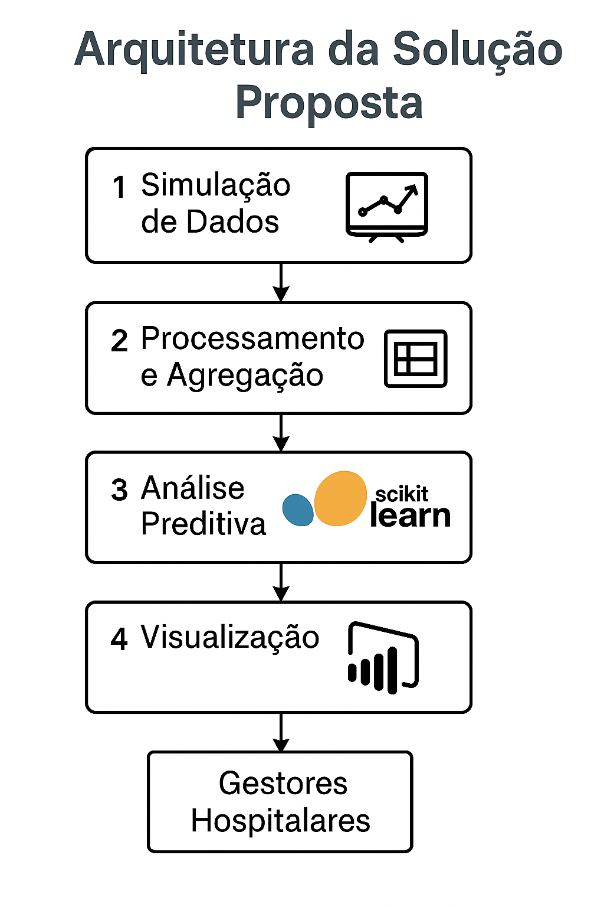

# 🏥 Business Intelligence Hospitalar – PUCRS (Fase 2)

Este projeto foi desenvolvido como parte da disciplina **Projeto em Business Intelligence e Analytics** da **PUCRS**, com o objetivo de aplicar conceitos de **Business Intelligence (BI)** e **Analytics** ao contexto hospitalar, simulando dados de atendimentos de urgência, aplicando **modelagem preditiva** e construindo **dashboards analíticos interativos**.

---

## 🎯 Objetivo

Fornecer uma solução completa de **Business Intelligence e Analytics** que permita à gestão hospitalar:

- Monitorar **indicadores de desempenho** (tempo médio de espera, tempo médio de atendimento, taxa de internação, produtividade);
- Identificar **horários e dias de pico** de atendimento;
- Apoiar a **tomada de decisão baseada em dados confiáveis**;
- **Prever a demanda de pacientes por hora** por meio de técnicas de Machine Learning (Analytics).

---

## 🧩 Arquitetura da Solução

A solução foi desenvolvida em quatro etapas principais, conforme o fluxo abaixo:

1. **Simulação de Dados – Python:**  
   Geração de dados sintéticos de atendimentos hospitalares de urgência, incluindo data/hora de chegada, triagem, especialidade, tempo de espera e desfecho.

2. **Processamento e Agregação – pandas:**  
   Transformação e agregação dos atendimentos em uma visão horária (`demanda_horaria_urgencia_simulado.csv`), com indicadores de demanda e tempo médio de espera.

3. **Análise Preditiva – scikit-learn / Random Forest:**  
   Treinamento de um modelo de **Machine Learning** para prever o número de pacientes por hora com base em hora do dia, dia da semana e mês.  
   O resultado gera um dataset com a coluna `qtd_prevista`, permitindo comparação entre **demanda real x prevista**.

4. **Visualização e Indicadores – Power BI:**  
   Importação dos dados simulados e preditos no Power BI, criação de **medidas DAX**, **dashboards interativos** e **painéis executivos** para análise operacional e estratégica.  
   KPIs apresentados incluem:
   - Tempo Médio de Espera (min)  
   - Tempo Médio de Atendimento (min)  
   - Taxa de Internação (%)  
   - Quantidade Total de Atendimentos  
   - Comparação Real x Previsto  

---

## 🧠 Analytics

O modelo preditivo foi implementado em Python utilizando **scikit-learn**, com o algoritmo **Random Forest Regressor**.  
Ele prevê a **demanda horária de atendimentos** a partir das variáveis:

- `hora_chegada`
- `dia_semana`
- `mes`

📈 **Desempenho obtido:**
- **R²:** ≈ 0.83  
- **MAE:** ≈ 1.5 pacientes/hora  

🔹 *Script:* [`codigo/analytics_predictive.py`](codigo/analytics_predictive.py)  
🔹 *Entrada:* `dados/demanda_horaria_urgencia_simulado.csv`  
🔹 *Saída:* `dados/demanda_horaria_urgencia_com_previsao.csv`

---

## 📊 Dashboards

| Painel | Descrição |
|--------|------------|
| **Visão Geral** | KPIs principais e tendências de tempo de espera. |
| **Triagem e Fluxo** | Distribuição por nível de triagem, hora e dia da semana. |
| **Desempenho Operacional** | Comparação entre demanda real e prevista. |

📸 *Imagens dos dashboards:*  
- `dashboards/dashboard_visao_geral.png`  
- `dashboards/dashboard_triagem_fluxo.png`  
- `dashboards/dashboard_desempenho.png`

---

---

## 🧾 Relatórios

- 📄 `docs/Relatorio_Fase2_PUCRS.pdf` – relatório técnico final

---

## 🧑‍💻 Autor

**Lucas Lavnicki**  
Engenheiro de Dados | Estudante PUCRS – Banco de Dados: Ênfase em Data & Analytics  
[LinkedIn](https://www.linkedin.com/in/lucas-lavnicki-data-engineer/) | [GitHub](https://github.com/lavnicki)